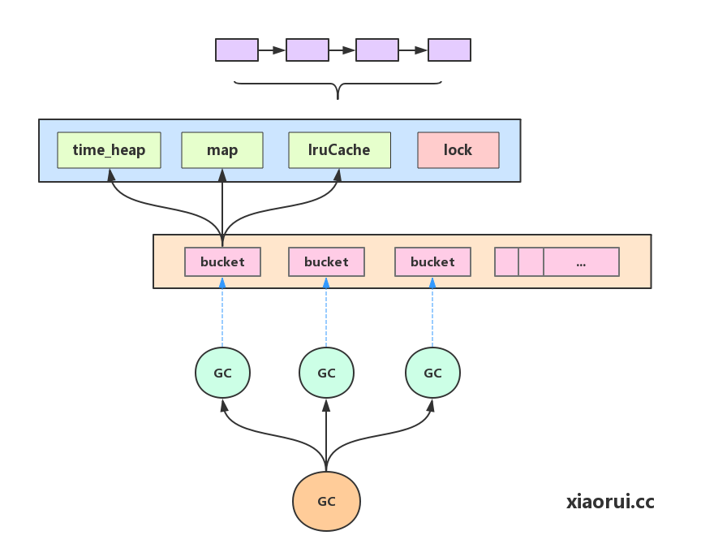

# emap

advance golang map, it support expire ttl and lru action.

## Features

* support expire kv and lru.
* goroutine safe
* reduce futex call
* support getInt, getString, Incr cmd

## Usage

...

